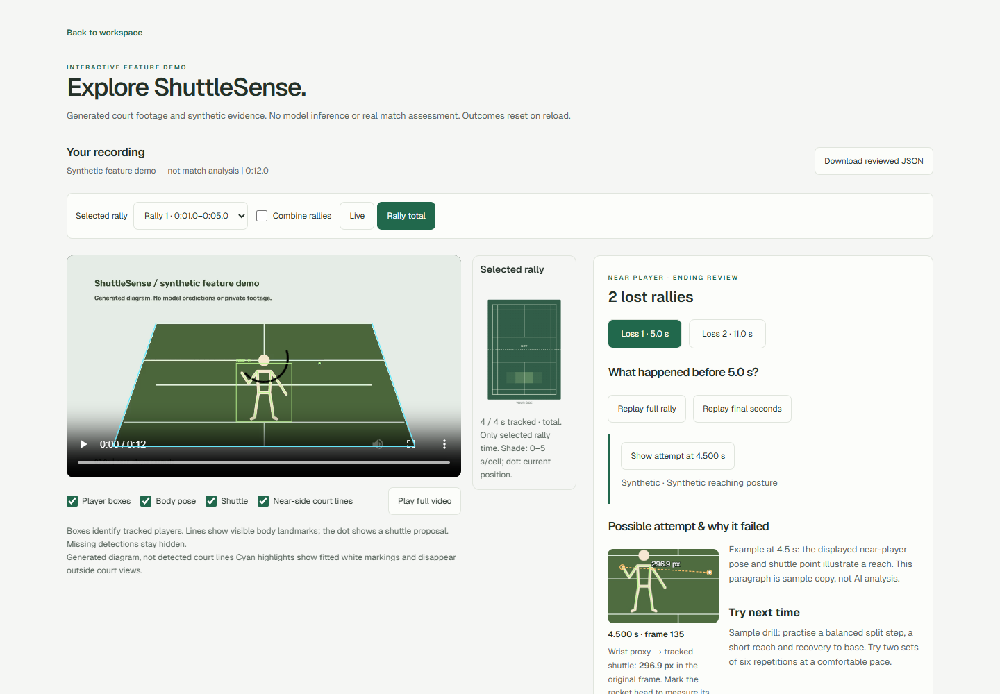
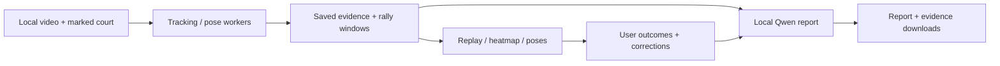

# ShuttleSense

**Local AI badminton video analysis, grounded in rally evidence.**

Replay rallies, inspect near-player poses, compare court movement and turn the
available evidence into a practical training report. Videos and inference stay local.



[Watch the feature walkthrough](https://github.com/ss-sevesh/shuttlesense/blob/main/docs/media/shuttlesense-walkthrough.mp4)
· [Download the MP4](https://raw.githubusercontent.com/ss-sevesh/shuttlesense/main/docs/media/shuttlesense-walkthrough.mp4)
· [User guide](docs/USER-GUIDE.md) · [Analysis setup](docs/SETUP.md)
· [Contributing](CONTRIBUTING.md)

The walkthrough uses generated footage, synthetic poses and sample coaching.
It demonstrates the interface, not model accuracy.

## Try it in two minutes

Install Node.js 22 or newer and Git:

```sh
git clone https://github.com/ss-sevesh/shuttlesense.git
cd shuttlesense
npm install
npm run dev
```

Open **http://127.0.0.1:3000/demo** for the interactive feature demo.
No Python, GPU, API key, model download or private footage is needed for the demo.
On Windows PowerShell use `npm.cmd` and `npx.cmd` instead of the `.ps1` shims.
The workspace is **http://127.0.0.1:3000**; saved recordings appear in **My Matches**.

## Features

| Feature | What it does |
| --- | --- |
| Rally replay | Play a bounded rally or final seconds; correct observed boundaries. |
| Rally-only heatmap | Live movement inside selected rally windows; excludes between-point time. |
| Combine rallies | Choose multiple rallies and show combined live progress or full totals. |
| Evidence overlays | Toggle player boxes, body pose, shuttle proposals and near-side court lines. |
| Hit-pose timestamps | Pause at a candidate frame, auto-scroll to video, or replay surrounding movement. |
| Body angles | Inspect reliable shoulders, elbows, wrists, hips, knees and ankles; missing stays unknown. |
| Loss review | Mark outcomes, view the attempt photo and request a local AI ending explanation. |
| Image separation | Wrist-to-shuttle proxy or manually marked racket-head gap, in image pixels. |
| AI match report | Text-only Qwen3-4B reviews; lost-rally photos attached beside descriptions after generation. |
| Private exports | Download report, exact AI evidence, and original detector data with separate corrections. |

Shot-type classification is removed from review and upload controls.
Legacy classifier fields remain readable in saved reports and JSON exports.

## Real video analysis

The model pipeline currently targets **Windows with an NVIDIA CUDA GPU**,
Python and FFmpeg. The interface/demo work without it. Follow [the setup guide](docs/SETUP.md),
upload a short clip, mark four visible singles-court corners and enable required features.

Use a fixed camera with the full court and both players visible. Camera motion,
broadcast cuts and occlusions reduce usable evidence. No training dataset is needed.

| Component | Pretrained model / method |
| --- | --- |
| Players | YOLO11n-pose boxes + ByteTrack identities |
| Body landmarks | MediaPipe Pose Landmarker Full |
| Shuttle proposals | TrackNetV3 |
| Floor segmentation | SegFormer B0 ADE20K |
| Court markings | OpenCV white-pixel fitting guided by marked singles-court geometry |
| Optional loss explanation | Pinned local Qwen3-VL-2B-Instruct (five ending-context images) |
| Match report | Qwen3-4B-Instruct-2507, pinned Unsloth Q4_K_M GGUF through local Ollama; text only |

Weights are downloaded separately and excluded from Git.
The current implementation is a research prototype, not a hosted analysis service.

## What the evidence means

- Rally endings are estimated shuttle stops, **not confirmed first ground touch**.
  Line highlights do not provide verified in/out calls. Outcomes are user marked.
- Hit poses are swing/contact candidates, not a validated hit count. Their count
  need not match accepted legacy shot labels, which use separate filtering.
- Movement is projected player-box occupancy, not verified foot contacts.
  Heat uses a fixed **0–5 seconds per cell** scale; tooltips retain exact seconds.
- Angles are confidence-gated, camera-dependent 2D estimates. Wrist angles use an
  index-finger proxy. Automatic racket-face angles and physical reach are unavailable.
- AI interpretations can be wrong. Reports cover the supplied recording, not unseen
  parts of the original match. They distinguish observation from possible intent.
  All eligible hit-pose timestamps/angles are retained; dense movement and shuttle
  tracks use chronological one-second summaries. Download the AI evidence to inspect inputs.
  Numerical angle prose is excluded; exact joint values stay in the appendix.
  Reports use one structured call per rally plus an overall summary when context fits.
  Oversized rallies split without losing pose events. Ollama stays warm between
  calls, then releases report weights so vision workers can use the GPU.
  A wording check allows one automatic correction per response when needed;
  failed validation is shown instead of fabricating a fallback report.
  The portable HTML download embeds exact loss photos; Print saves it as PDF.

Independent detection accuracy and coaching usefulness remain unvalidated.
See [the evaluation protocol](docs/evaluation.md).

## Development

```sh
npm run build
npm run typecheck
npx playwright test tests/public-demo.spec.ts
python -m unittest discover -s analysis -p test_match_report.py
```

Playwright uses an installed Chrome browser. Public-demo tests need no private files
or models. Real-video tests require local saved reports and approved footage;
do not run historical footage suites indiscriminately.

Regenerate public assets with NumPy/OpenCV and FFmpeg:
`python scripts/generate-demo.py`, start the app, then
`node scripts/record-demo.mjs`. Both generators use synthetic data only.

## Architecture



Next.js · React · TypeScript · native CSS · Python · PyTorch · OpenCV.
Local jobs and cached reports live under ignored `data/analysis-jobs/`.
Model work is serialized. Analysis APIs are loopback-only; do not expose the
development server as a public upload service.

## Privacy and project status

Private footage, model weights, analysis results and review screenshots stay ignored.
Only generated demo assets and a synthetic walkthrough are published.
Model downloads access official hosts; inference then uses local files.

No account system, cloud storage or trained badminton-specific intent model is included.
Upstream models have their own terms; consult those before redistributing weights
or commercial use. This repository grants no rights to private test footage.

See [handoff](tasks/HANDOFF.md), [plan](tasks/plan.md) and [tasks](tasks/todo.md)
for current work and research history. Open reproducible issues without private
videos, credentials or personal data.
